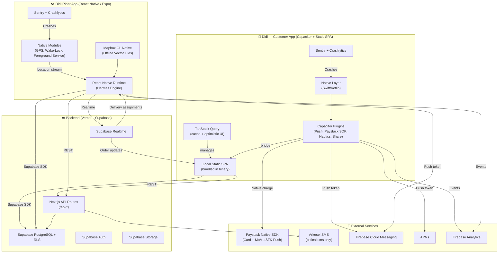

# Didi Mobile App — Production Architecture Plan v3

## Background & Current Stack Audit

After thoroughly auditing the **Didi** codebase ([`/Users/ebenezerbarning/Desktop/fafa`](file:///Users/ebenezerbarning/Desktop/fafa)), here is what we're working with:

| Layer | Technology | Key Files |
|---|---|---|
| **Framework** | **Next.js 16** (App Router, React 19, Turbopack) | [next.config.ts](file:///Users/ebenezerbarning/Desktop/fafa/apps/web/next.config.ts) |
| **Monorepo** | Turborepo with `apps/web` + `packages/types`, `packages/ui` | [turbo.json](file:///Users/ebenezerbarning/Desktop/fafa/turbo.json) |
| **Styling** | **Tailwind CSS 4** with custom design tokens (brand colours, glassmorphism, animations) | [globals.css](file:///Users/ebenezerbarning/Desktop/fafa/apps/web/app/globals.css) |
| **Backend/DB** | **Supabase** (PostgreSQL, Auth, RLS, Realtime) — 22 migrations | [migrations/](file:///Users/ebenezerbarning/Desktop/fafa/supabase/migrations) |
| **Auth** | Supabase Auth with JWT-based tenant claims, middleware session refresh | [middleware.ts](file:///Users/ebenezerbarning/Desktop/fafa/apps/web/middleware.ts) |
| **Payments** | **Paystack** (Card + MoMo, GHS currency, subaccounts for split payments) | [paystack/client.ts](file:///Users/ebenezerbarning/Desktop/fafa/apps/web/lib/paystack/client.ts) |
| **Notifications** | SMS (Arkesel), Email (Brevio), WhatsApp (Twilio) — unified dispatcher | [notifications/send.ts](file:///Users/ebenezerbarning/Desktop/fafa/apps/web/lib/notifications/send.ts) |
| **State Mgmt** | React Context + `useReducer` (cart), localStorage persistence | [use-cart.tsx](file:///Users/ebenezerbarning/Desktop/fafa/apps/web/hooks/use-cart.tsx) |
| **AI** | Adepa AI concierge (Vercel AI SDK, tool-use, Ghanaian food vocabulary) | [lib/adepa/](file:///Users/ebenezerbarning/Desktop/fafa/apps/web/lib/adepa) |
| **PWA** | Service worker (network-first navigation, cache-first assets), web manifest, install prompt | [sw.js](file:///Users/ebenezerbarning/Desktop/fafa/apps/web/public/sw.js), [manifest.ts](file:///Users/ebenezerbarning/Desktop/fafa/apps/web/app/manifest.ts) |
| **Maps** | Leaflet.js for delivery location picker | [package.json](file:///Users/ebenezerbarning/Desktop/fafa/apps/web/package.json) |
| **Delivery Logic** | Haversine distance pricing, Ghana area centroids, manual zone overrides | [delivery/](file:///Users/ebenezerbarning/Desktop/fafa/apps/web/lib/delivery) |
| **Multi-tenant** | Slug-based storefronts (`/[slug]`), per-tenant branding (colours, logos) | [storefront layout](file:///Users/ebenezerbarning/Desktop/fafa/apps/web/app/(storefront)/[slug]/layout.tsx) |

### Key Architecture Traits
- **Server-side heavy**: Next.js App Router with Server Components, server actions, and API routes handle auth checks, tenant resolution, and data fetching.
- **No standalone API layer**: Business logic lives in Next.js route handlers (`app/api/`) and server-side `lib/` modules — there is no separate REST/GraphQL backend.
- **Thin client state**: Only the cart uses client-side state; everything else is server-rendered or fetched via Supabase client directly.
- **Ghana-optimised CSS**: Safe-area insets, 44px tap targets, touch manipulation, reduced-motion support, and 16px input zoom fix already built in.

---

## Recommended Mobile Strategy: Hybrid — Capacitor (Local Static Export) + React Native

### The Verdict

**Capacitor with a local static export** for the Customer/Merchant app. **React Native (Expo)** for the Didi Rider app. No remote URL loading — the entire customer app is compiled, bundled, and shipped inside the binary.

### Why Hybrid Wins for Didi

| Requirement | Didi Customer App | Didi Rider App |
|---|---|---|
| **UI complexity** | Rich multi-tenant storefronts, Adepa AI, checkout flows | Simple: delivery queue, map, status toggles |
| **Code reuse from PWA** | ~80% (after SSR → CSR migration of layouts) | ~5% (only `packages/types` + `delivery/pricing.ts`) |
| **Native hardware needs** | Medium (push, haptics, share, **native Paystack SDK**) | Heavy (persistent background GPS, wake-locks, foreground services) |
| **Maps** | Leaflet.js for location picker (adequate) | **Mapbox GL Native** with offline vector tiles (critical) |
| **Background processing** | None | Continuous GPS telemetry while screen-off |
| **Target devices** | All smartphones | Low-end Transsion (Tecno, Infinix) — needs maximum native performance |
| **Optimal framework** | **Capacitor** (local static export) | **React Native / Expo** (true native rendering + native modules) |

> [!IMPORTANT]
> **This is not "two apps = double the work."** The Customer app reuses ~80% of existing React components with a TanStack Query data layer swap. The Rider app is a focused RN project with ~6 screens. Both share the same Supabase backend and `@fafa/types`.

---

## 1. Compilation Layer: Local Static Export

> [!CAUTION]
> **Remote URL mode is rejected.** Loading `https://www.ghdidi.com` inside a WebView violates Apple App Store Guideline 4.2 (Minimum Functionality) and introduces a hard dependency on network connectivity. We compile the app locally.

### Strategy: `output: 'export'` Static SPA

The Next.js app is compiled to a fully static SPA (`next export` / `output: 'export'`) bundled inside the Capacitor binary. The WebView loads from `file://` — **zero network dependency for initial render**.

| Aspect | Implementation |
|---|---|
| **Next.js config** | `next.config.ts` → `output: 'export'`, `trailingSlash: true` |
| **Server Components** | Migrated to Client Components with TanStack Query (see §2) |
| **API routes** | Remain deployed on Vercel/Supabase Edge — the app calls them via HTTPS |
| **Static assets** | Bundled in `android/app/src/main/assets/public/` and `ios/App/App/public/` |
| **Capacitor config** | `server: { url: undefined }` — loads from local filesystem |
| **Routing & dynamic path insurance** | **Routing Insurance**: Serving dynamic paths like `/[slug]` under local `file://` protocol fails without a server rewrite engine. We will map routes via client-side hash routing (`HashRouter`) OR configure Capacitor's `server.androidScheme` and override WebView requests natively (`WKNavigationDelegate` on iOS, `WebViewClient` on Android) to rewrite dynamic paths to `/[slug]/index.html` while preserving dynamic parameter parsing. |
| **App updates** | Critical: Use `@nicegram/capacitor-app-update` or custom update checker — prompt users to update from Play/App Store. For non-native changes, consider a lightweight Code Push strategy |

### What Migrates vs. What Stays Server-Side

```
┌──────────────────────────────────────────────────────────┐
│                  BUNDLED IN BINARY (static)               │
│                                                          │
│  ✅ All React component UI (storefront, dashboard, auth) │
│  ✅ Tailwind CSS + design system                         │
│  ✅ Cart logic (useReducer + localStorage)               │
│  ✅ Delivery pricing (pure math, no I/O)                 │
│  ✅ Ghana areas data (static JSON)                       │
│  ✅ Adepa AI widget (client component, calls API)        │
│  ✅ Static assets (icons, images, fonts)                 │
└──────────────────────────────────────────────────────────┘

┌──────────────────────────────────────────────────────────┐
│              REMOTE API (Vercel + Supabase)               │
│                                                          │
│  🌐 /api/orders/* — order CRUD                           │
│  🌐 /api/webhooks/paystack — payment verification        │
│  🌐 /api/push/register — FCM token storage               │
│  🌐 /api/delivery/location — rider GPS updates           │
│  🌐 /api/adepa/* — AI chat completions                   │
│  🌐 Supabase Auth — login, session, JWT refresh           │
│  🌐 Supabase Realtime — order status subscriptions        │
│  🌐 Supabase Storage — menu images, logos                 │
└──────────────────────────────────────────────────────────┘
```

### App Store Compliance (Guideline 4.2)

Apple rejects "apps that are simply repackaged websites." Our local static export passes because:

1. **No remote page loading** — UI renders from bundled files, not a URL
2. **Native features** — Push notifications, Paystack native SDK, haptics, biometric login, deep linking, share sheet
3. **Offline functionality** — Storefront browsing, menu viewing, and cart management work without network
4. **Custom native code** — Capacitor plugin bridges are compiled native Swift/Kotlin

---

## 2. Data Architecture: TanStack Query Client-Side Layer

> [!IMPORTANT]
> **All Next.js Server Component data-fetching is migrated to client-side TanStack Query.** The `output: 'export'` mode eliminates server components — every layout and page becomes a Client Component that fetches data via Supabase JS SDK, managed by TanStack Query for caching, deduplication, and optimistic updates.

### Migration Blueprint

| Current (Server Components) | New (TanStack Query) |
|---|---|
| `createServerClient()` in layouts | `createBrowserClient()` + `useQuery()` |
| `await supabase.from('tenants').select()` in RSC | `useQuery({ queryKey: ['tenant', slug], queryFn: fetchTenant })` |
| `await supabase.auth.getSession()` in middleware | `useQuery({ queryKey: ['session'], queryFn: getSession })` + `QueryClient` prefetch |
| Server-side redirect on auth failure | Client-side `useEffect` redirect with loading skeleton |
| Inline data in HTML response | Cached in QueryClient — persisted to `@capacitor/preferences` |

### Query Architecture

```typescript
// packages/query/src/client.ts — shared query configuration
import { QueryClient } from '@tanstack/react-query';
import { createBrowserClient } from '@/lib/supabase/client';

export const queryClient = new QueryClient({
  defaultOptions: {
    queries: {
      // Stale after 2 minutes — menus don't change every second
      staleTime: 2 * 60 * 1000,
      // Cache for 30 minutes — survive background/foreground cycles  
      gcTime: 30 * 60 * 1000,
      // Retry with exponential backoff — Ghana's spotty networks
      retry: 3,
      retryDelay: (attempt) => Math.min(1000 * 2 ** attempt, 30000),
      // Don't refetch on window focus in mobile (wastes data)
      refetchOnWindowFocus: false,
    },
  },
});
```

### Key Query Hooks

```typescript
// hooks/use-tenant.ts
export function useTenant(slug: string) {
  return useQuery({
    queryKey: ['tenant', slug],
    queryFn: async () => {
      const supabase = createBrowserClient();
      const { data, error } = await supabase
        .from('tenants')
        .select('*')
        .eq('slug', slug)
        .eq('status', 'active')
        .single();
      if (error) throw error;
      return data;
    },
    staleTime: 5 * 60 * 1000, // tenant data rarely changes
  });
}

// hooks/use-menu.ts
export function useMenu(tenantId: string) {
  return useQuery({
    queryKey: ['menu', tenantId],
    queryFn: async () => {
      const supabase = createBrowserClient();
      const { data } = await supabase
        .from('menu_items')
        .select('*, category:menu_categories(*)')
        .eq('tenant_id', tenantId)
        .eq('is_available', true)
        .order('sort_order');
      return data ?? [];
    },
    staleTime: 3 * 60 * 1000,
  });
}

// hooks/use-orders.ts — with optimistic updates
export function useUpdateOrderStatus() {
  const queryClient = useQueryClient();
  return useMutation({
    mutationFn: async ({ orderId, status }) => {
      const res = await fetch('/api/orders/status', {
        method: 'PATCH',
        body: JSON.stringify({ orderId, status }),
      });
      return res.json();
    },
    onMutate: async ({ orderId, status }) => {
      // Optimistic update — instant UI feedback
      await queryClient.cancelQueries({ queryKey: ['orders'] });
      const prev = queryClient.getQueryData(['orders']);
      queryClient.setQueryData(['orders'], (old) =>
        old?.map((o) => o.id === orderId ? { ...o, status } : o)
      );
      return { prev };
    },
    onError: (_err, _vars, ctx) => {
      queryClient.setQueryData(['orders'], ctx?.prev);
    },
    onSettled: () => {
      queryClient.invalidateQueries({ queryKey: ['orders'] });
    },
  });
}
```

### Offline Query Persistence

```typescript
// Persist query cache to Capacitor Preferences for instant cold-start
import { persistQueryClient } from '@tanstack/react-query-persist-client';
import { Preferences } from '@capacitor/preferences';

const capacitorPersister = {
  persistClient: async (client) => {
    await Preferences.set({ key: 'QUERY_CACHE', value: JSON.stringify(client) });
  },
  restoreClient: async () => {
    const { value } = await Preferences.get({ key: 'QUERY_CACHE' });
    return value ? JSON.parse(value) : undefined;
  },
  removeClient: async () => {
    await Preferences.remove({ key: 'QUERY_CACHE' });
  },
};

persistQueryClient({ queryClient, persister: capacitorPersister });
```

### Benefits for Ghana Market

| Feature | Impact |
|---|---|
| **Request deduplication** | Multiple components requesting the same tenant data = 1 network call |
| **Stale-while-revalidate** | Show cached menu instantly, refresh in background. No loading spinner on revisit |
| **Optimistic updates** | Order status changes feel instant — critical on 3G latency (200–500ms RTT) |
| **Offline persistence** | Cached menus survive app kill. User reopens → sees last-viewed storefront immediately |
| **Retry with backoff** | Automatic retry on spotty connections — no manual "try again" frustration |
| **GC-based memory** | `gcTime` prevents unbounded memory growth on 2GB RAM devices |

---

## 3. Transaction Flow: Native Paystack SDK (Phase 1)

> [!CAUTION]
> **Browser-redirect payment flow is eliminated.** Opening `authorization_url` in an external browser breaks the user journey, risks session loss, and fails when mobile data drops mid-redirect. We integrate the Paystack native SDKs directly.

> [!IMPORTANT]
> **Escape Hatch (Timeline Insurance):** If the custom native Paystack wrapper Swift/Kotlin code blocks Phase 1 compilation due to SDK updates or tooling issues, we fallback to a securely configured `@capacitor/browser` in-app browser implementation. We will intercept the completed transaction using a custom deep-link scheme (`didi://payment-complete?reference=REF_ID`). The Capacitor App listener will close the custom tab, trigger a TanStack Query cache invalidation, and let the Supabase Realtime subscription confirm the order status.

### Customer App — Capacitor Paystack Plugin

| Component | Solution |
|---|---|
| **Android** | Custom Capacitor plugin wrapping `com.paystack.android.core:paystack` SDK |
| **iOS** | Custom Capacitor plugin wrapping `PaystackCore` Swift SDK |
| **MoMo flow** | **STK Push** — Paystack sends USSD prompt directly to customer's phone. No browser. No redirect. Customer confirms on their dialer and gets instant callback |
| **Card flow** | Native card form rendered by Paystack SDK inside the app. PCI-DSS compliance handled by Paystack |
| **Webhook** | Unchanged — `/api/webhooks/paystack` still receives server-to-server confirmation |

### Native Payment Flow

```
Customer taps "Pay with MoMo" →
  Capacitor plugin calls PaystackSDK.chargeCard/chargeMobileMoney →
    SDK sends STK Push to customer's phone →
      Customer dials USSD confirmation (*170# prompt) →
        Paystack sends webhook to /api/webhooks/paystack →
          Server updates order.payment_status = 'paid' →
            Supabase Realtime pushes update to app →
              UI shows ✅ "Payment confirmed" with haptic burst
```

### Why This Must Be Phase 1

1. **Payment is the core conversion event** — any friction here = lost revenue
2. **MoMo STK Push** works without mobile data (it's USSD) — but the redirect flow requires data to load Paystack's web checkout
3. **Session continuity** — no risk of losing cart state when switching to/from browser
4. **App Store compliance** — Apple prefers native payment UIs over web redirects

### Paystack Plugin Architecture

```typescript
// plugins/capacitor-paystack/src/definitions.ts
export interface PaystackPlugin {
  initialize(options: { publicKey: string }): Promise<void>;
  chargeMobileMoney(options: {
    email: string;
    amount: number;       // pesewas
    currency: 'GHS';
    phone: string;
    provider: 'mtn' | 'vod' | 'tgo';  // MTN, Vodafone, AirtelTigo
    reference: string;
    metadata?: Record<string, unknown>;
  }): Promise<{ reference: string; status: 'success' | 'pending' }>;
  chargeCard(options: {
    email: string;
    amount: number;
    currency: 'GHS';
    reference: string;
  }): Promise<{ reference: string; status: 'success' }>;
}
```

---

## 4. Architecture Overview

> [!IMPORTANT]
> **Two apps, two frameworks, local-first.** Capacitor loads a locally-bundled static SPA for the Customer app. React Native (Expo) runs a fully native Rider app. Both talk to the same Supabase backend and Next.js API routes deployed on Vercel.



### How It Works

1. **Didi Customer App**: Capacitor loads the locally-bundled static SPA from `file://`. TanStack Query fetches data from Supabase, caches aggressively, and persists to `@capacitor/preferences` for instant cold starts.
2. **Didi Rider App**: Standalone React Native (Expo) app with Mapbox GL Native for 60fps offline-capable maps. Talks directly to Supabase and Next.js API routes.
3. **Paystack Native SDK**: Card and MoMo payments processed in-app via native SDK. No browser redirects.
4. **Supabase Realtime**: Pushes live order updates to Customer app and new delivery assignments to Rider app.
5. **Diagnostics**: Sentry + Firebase Crashlytics capture crashes, ANRs, memory leaks, and unhandled JS exceptions across both apps.
6. **Updates**: Customer app bundles updates via store releases (or lightweight code-push). Rider app uses `expo-updates` for JS-layer OTA.

---

## 5. Native Feature Strategy

### 5.1 Push Notifications (FCM + APNs) — Hybrid with SMS

**Resolved decision**: Push notifications **supplement** SMS — they don't replace it.

| Component | Customer App (Capacitor) | Rider App (React Native) |
|---|---|---|
| **Plugin/Library** | `@capacitor/push-notifications` | `@react-native-firebase/messaging` |
| **Android** | FCM via Capacitor plugin | FCM via React Native Firebase |
| **iOS** | APNs via FCM | APNs via React Native Firebase |
| **Token storage** | `device_tokens` table, `app_type: 'customer'` | Same table, `app_type: 'rider'` |
| **Sending** | `/api/push/send` via Firebase Admin SDK | Same API route |

**Notification routing matrix**:

| Event | Push | SMS (Arkesel) | Email (Brevio) |
|---|---|---|---|
| Order placed | ✅ | ✅ (critical) | ✅ |
| Order confirmed | ✅ (primary) | ❌ (save cost) | ❌ |
| Order ready | ✅ (primary) | ❌ | ❌ |
| Rider en route | ✅ (primary) | ❌ | ❌ |
| Delivered | ✅ | ❌ | ❌ |
| Payment confirmed | ✅ | ✅ (critical) | ✅ |
| Order cancelled | ✅ | ✅ (critical) | ❌ |
| Marketing/promo | ✅ (low priority) | ❌ | ❌ |

**Low-end Android optimisation**:
- FCM high-priority messages only for order updates (not marketing)
- Payload < 4KB, `data` messages for full display control
- Notification channels: `orders` (high importance), `marketing` (low importance)

### 5.2 Background Geolocation (Didi Rider App — React Native)

**Current state**: No rider tracking exists. Delivery status is manually toggled.

Background GPS lives **exclusively in the React Native Didi Rider app**. React Native gives direct access to native foreground services, wake-locks, and headless JS tasks — critical for surviving Transsion's HiOS (Tecno), XOS (Infinix), and Itel's custom Android skins.

| Component | Solution |
|---|---|
| **App** | **Didi Rider** (React Native / Expo in `apps/rider`) |
| **Library** | `@transistorsoft/react-native-background-geolocation` |
| **Maps** | **Mapbox GL Native** with offline vector tile packs (see §5.6) |
| **Routing** | Mapbox Directions API for turn-by-turn polyline overlay |
| **Tracking mode** | Geofence + periodic updates (every 30s when out for delivery) |
| **Battery** | Significant motion detection; stop when stationary > 5min |
| **Data flow** | Location → POST `/api/delivery/location` → Supabase `rider_locations` |
| **Customer view** | Supabase Realtime → update map in Customer app |

**Battery preservation (Transsion / low-end Android)**:
- Track ONLY when order status = `out_for_delivery`
- `desiredAccuracy: HIGH` in cities, `MEDIUM` outside
- Distance filter: 50m
- Native foreground service: sticky notification "Didi Rider — Tracking active delivery"
- `REQUEST_IGNORE_BATTERY_OPTIMIZATIONS` for Transsion/Infinix/Itel
- `react-native-background-fetch` for heartbeat check-ins
- Battery-level awareness: reduce frequency below 15%

> [!WARNING]
> **App Store**: Rider app's Info.plist must include `NSLocationAlwaysAndWhenInUseUsageDescription`. The **Customer app does NOT request background location**.

### 5.3 Payments — Native Paystack SDK (see §3 for full detail)

- **MoMo STK Push**: In-app USSD trigger, no browser redirect
- **Card**: Native Paystack form, PCI-DSS compliant
- **Webhook**: `/api/webhooks/paystack` unchanged
- **Phase**: Ships in **Phase 1** (not deferred)

### 5.4 Deep Linking

| Platform | Configuration |
|---|---|
| **Android** | `assetlinks.json` at `ghdidi.com/.well-known/assetlinks.json` |
| **iOS** | `apple-app-site-association` at `ghdidi.com/.well-known/apple-app-site-association` |
| **Customer Plugin** | `@capacitor/app` (deep link listener) |
| **Rider** | Expo Linking + `expo-router` deep route matching |

**URL scheme**: `didi://` fallback. `ghdidi.com/chopbar` → opens storefront in app. `ghdidi.com/chopbar/order/abc123` → opens order tracking.

### 5.5 Secure Local Storage

| Need | Customer App (Capacitor) | Rider App (React Native) |
|---|---|---|
| **Session tokens** | `@capacitor/preferences` (iOS Keychain, Android EncryptedSharedPreferences) | `expo-secure-store` (Keychain / Keystore) |
| **Cached data** | TanStack Query → `@capacitor/preferences` persistence | TanStack Query → `@react-native-async-storage/async-storage` |
| **Cart state** | `localStorage` (exists, works in WebView) | N/A |
| **Query cache** | Persisted via `persistQueryClient` (see §2) | Same pattern |

### 5.6 Map Performance: Mapbox GL Native (Rider App)

> [!IMPORTANT]
> **Leaflet in a WebView is rejected for the Rider app.** Leaflet uses rasterised tiles that chew through mobile data and stutter on 2GB RAM devices. Mapbox GL Native renders vector tiles on the GPU with 60fps fluidity and supports offline tile caching.

| Component | Solution |
|---|---|
| **Library** | `@rnmapbox/maps` (React Native Mapbox GL) |
| **Tile source** | Mapbox Streets v12 vector tiles |
| **Offline packs** | **Lazy Maps (Progressive)**: Small, localized bounding-box vector tiles downloaded progressively based on active delivery routes (e.g., origin-to-destination corridor) instead of forcing a bulk ~25MB download on setup. |
| **Directions** | Mapbox Directions API → route polyline rendered on native MapView |
| **Data savings** | Vector tiles are ~10x smaller than raster tiles. Lazy route corridors use only ~1–2 MB of storage. |
| **Turn-by-turn** | Mapbox Navigation SDK or deep-link to Google Maps for step-by-step |

**Offline tile strategy**:
```
Active delivery assigned → calculate route bounding box with 500m buffer →
  Download local vector tile pack for the active corridor (~1–2 MB) →
    Stored in app's SQLite Mapbox cache →
      Rider navigates offline or in spotty zones using cached corridor tiles →
        Periodic cache sweep removes tiles older than 3 days to preserve device storage
```

**Performance on 2GB RAM devices**:
- Vector rendering uses GPU (even low-end Mali GPUs handle this well)
- No DOM/WebView overhead — pure native OpenGL rendering
- Memory usage: ~40–60 MB vs. ~120–180 MB for Leaflet in WebView
- Smooth 60fps pan/zoom even on Tecno Spark 10

### 5.7 Offline-First Caching (Customer App — Browse Only)

Offline support is limited to **browsing cached menus only**. No offline order queue.

**TanStack Query + Capacitor Preferences** replaces the service worker strategy:

| Data | Cache Strategy | TTL |
|---|---|---|
| Tenant profile | `staleTime: 5min`, persisted | 30 min gc |
| Menu items + categories | `staleTime: 3min`, persisted | 30 min gc |
| Menu images | Capacitor filesystem cache + WebP | 7 days |
| Cart | `localStorage` (immediate) | Until cleared |
| Order history | `staleTime: 1min` | 15 min gc |
| Session/Auth | Supabase token auto-refresh | Until logout |

**Offline UX**:
- App opens → TanStack restores persisted cache → **instant render of last-viewed storefront** (0ms to first paint)
- Network unavailable → user browses cached menus, adds to cart
- Checkout button disabled: persistent banner "You are offline. Reconnect to place your order."
- Network restored → TanStack background-refetches stale queries → UI updates silently

---

## 6. Diagnostics: Crashlytics + Sentry (Phase 2)

> [!IMPORTANT]
> **Full crash and performance monitoring from day one of beta.** Both apps ship with Firebase Crashlytics (native crash reporting) and Sentry (JS exception tracking, performance traces, memory profiling).

### Dual-Layer Diagnostics

| Layer | Tool | What It Catches |
|---|---|---|
| **Native crashes** (OOM, SIGSEGV, ANR) | Firebase Crashlytics | Killed by Transsion battery manager, WebView OOM, native module crashes |
| **JS exceptions** (unhandled rejects, render errors) | Sentry | React error boundaries, failed API calls, TanStack Query errors |
| **Performance traces** | Sentry Performance | Time-to-interactive, slow queries, navigation transitions |
| **Memory profiling** | Sentry + Crashlytics | Detect leaks in TanStack cache, Mapbox tile cache, image loading |
| **OS-level terminations** | Crashlytics | Background kill by OEM battery saver, low-memory kills |
| **Network diagnostics** | Sentry Breadcrumbs | Failed Supabase calls, Paystack timeouts, GPS upload failures |

### Implementation

**Customer App (Capacitor)**:
```typescript
// Sentry for JS layer
import * as Sentry from '@sentry/capacitor';
import { BrowserTracing } from '@sentry/tracing';

Sentry.init({
  dsn: 'https://xxx@sentry.io/xxx',
  integrations: [new BrowserTracing()],
  tracesSampleRate: 0.2, // 20% of transactions — keeps costs low
  environment: 'production',
  beforeSend(event) {
    // Strip PII from breadcrumbs
    event.breadcrumbs = event.breadcrumbs?.map(b => ({
      ...b, data: undefined
    }));
    return event;
  },
});

// Firebase Crashlytics for native layer
// Configured via @capacitor-firebase/crashlytics plugin
```

**Rider App (React Native)**:
```typescript
import * as Sentry from '@sentry/react-native';
import crashlytics from '@react-native-firebase/crashlytics';

Sentry.init({
  dsn: 'https://xxx@sentry.io/xxx',
  tracesSampleRate: 0.3, // Higher for rider — fewer users, more critical
  enableNativeCrashHandling: true, // Sentry catches native crashes too
});

// Crashlytics for native-level diagnostics
crashlytics().setCrashlyticsCollectionEnabled(true);

// Custom keys for Ghana device diagnostics
crashlytics().setAttribute('device_brand', DeviceInfo.getBrand()); // "TECNO", "Infinix"
crashlytics().setAttribute('ram_gb', String(DeviceInfo.getTotalMemory() / 1e9));
crashlytics().setAttribute('network_type', netInfo.type); // "cellular", "wifi"
```

### Alert Pipeline

```
Crash/Error occurs →
  Sentry captures JS context + breadcrumbs →
  Crashlytics captures native stack trace →
    Both → grouped by device brand (TECNO, Infinix, Samsung) →
      Slack alert if crash-free rate < 99% →
        Prioritized by affected user count
```

---

## 7. Innovative MVP Features

### 7.1 Network-Aware Dynamic Media Streaming

Adapt image quality and loading strategy based on real-time connection quality. Critical in Ghana where users frequently oscillate between 4G, 3G, EDGE, and offline.

| Connection | Image Strategy | UI Behaviour |
|---|---|---|
| **4G / WiFi** | Full resolution WebP, eager load above-fold | Standard experience |
| **3G** | 50% resolution WebP, lazy load all | Slight quality reduction, much faster loads |
| **2G / EDGE** | 10% quality JPEG thumbnails, no hero images | Text-first layout, tap to load full image |
| **Offline** | Cached images from TanStack persistence | Show cached, placeholder for uncached |

**Implementation**:
```typescript
// hooks/use-network-quality.ts
import { Network } from '@capacitor/network';

export function useNetworkQuality() {
  const [quality, setQuality] = useState<'high' | 'medium' | 'low' | 'offline'>('high');

  useEffect(() => {
    const handler = Network.addListener('networkStatusChange', (status) => {
      if (!status.connected) return setQuality('offline');
      // Use effectiveType from Navigator.connection API in WebView
      const conn = (navigator as any).connection;
      if (conn?.effectiveType === '4g') setQuality('high');
      else if (conn?.effectiveType === '3g') setQuality('medium');
      else setQuality('low');
    });
    return () => { handler.then(h => h.remove()); };
  }, []);

  return quality;
}

// components/adaptive-image.tsx
export function AdaptiveImage({ src, alt }: { src: string; alt: string }) {
  const quality = useNetworkQuality();
  const params = {
    high: '?width=800&quality=85&format=webp',
    medium: '?width=400&quality=60&format=webp',
    low: '?width=150&quality=30&format=jpeg',
    offline: '', // use cached version
  };
  
  return (
    
  );
}
```

### 7.2 Native Shimmer Skeleton Screens

Replace blank loading states with premium shimmer skeletons that match the exact layout of each screen. Eliminates perceived latency on 3G networks.

**Customer App (Capacitor/WebView)**:
```css
/* Already have .skeleton in globals.css — enhance for specific screens */
.skeleton-menu-card {
  display: grid;
  grid-template-columns: 80px 1fr;
  gap: 12px;
  padding: 12px;
  border-radius: var(--radius-xl);
}
.skeleton-menu-card .image { width: 80px; height: 80px; border-radius: var(--radius-lg); }
.skeleton-menu-card .title { height: 16px; width: 70%; margin-bottom: 8px; }
.skeleton-menu-card .price { height: 14px; width: 30%; }
.skeleton-menu-card .desc  { height: 12px; width: 90%; }
```

```typescript
// components/skeletons/menu-skeleton.tsx
export function MenuSkeleton({ count = 6 }: { count?: number }) {
  return (
    <div className="space-y-3 animate-fade-in">
      {/* Category bar skeleton */}
      <div className="flex gap-2 overflow-hidden px-4">
        {[...Array(5)].map((_, i) => (
          <div key={i} className="skeleton h-8 w-20 rounded-full shrink-0" />
        ))}
      </div>
      {/* Menu item skeletons */}
      {[...Array(count)].map((_, i) => (
        <div key={i} className="skeleton-menu-card">
          <div className="image skeleton" />
          <div>
            <div className="title skeleton" />
            <div className="desc skeleton" />
            <div className="price skeleton mt-2" />
          </div>
        </div>
      ))}
    </div>
  );
}
```

**Rider App (React Native)**:
```typescript
// components/DeliveryQueueSkeleton.tsx
import { MotiView } from 'moti';
import { Skeleton } from 'moti/skeleton';

export function DeliveryQueueSkeleton() {
  return (
    <MotiView style={{ padding: 16, gap: 12 }}>
      {[...Array(4)].map((_, i) => (
        <MotiView key={i} style={{ flexDirection: 'row', gap: 12, padding: 12 }}>
          <Skeleton colorMode="light" width={60} height={60} radius={12} />
          <MotiView style={{ flex: 1, gap: 6 }}>
            <Skeleton colorMode="light" width="70%" height={16} />
            <Skeleton colorMode="light" width="40%" height={14} />
            <Skeleton colorMode="light" width="90%" height={12} />
          </MotiView>
        </MotiView>
      ))}
    </MotiView>
  );
}
```

**Integration with TanStack Query**:
```typescript
const { data: menu, isLoading } = useMenu(tenantId);

return isLoading ? <MenuSkeleton /> : <MenuList items={menu} />;
```

### 7.3 Contextual Audio/Haptic Cues for Delivery Riders

Riders are on motorbikes navigating Accra traffic — they can't stare at a screen. Audio and haptic cues provide eyes-free confirmation of key events.

| Event | Haptic Pattern | Audio Cue | Description |
|---|---|---|---|
| **New delivery assigned** | `notificationWarning` (3 heavy pulses) | Ascending chime + voice: "New delivery!" | Cuts through traffic noise |
| **Order picked up confirmed** | `notificationSuccess` (1 firm tap) | Short confirmation beep | Tactile acknowledgment |
| **Approaching destination** (200m) | `impactMedium` (2 quick taps) | Soft proximity tone | Eyes-free proximity alert |
| **Arrived at destination** | `notificationSuccess` (long buzz) | Voice: "You have arrived" | Clear arrival signal |
| **Delivery completed** | `selectionChanged` (light tap) | Cash register cha-ching 💰 | Rewarding completion sound |
| **Order cancelled** | `notificationError` (3 sharp taps) | Descending tone | Alert without alarm |
| **GPS signal lost** | `impactLight` (single soft tap) | Subtle warning beep | Non-intrusive alert |
| **Low battery warning** | `impactHeavy` (1 heavy tap) | Voice: "Battery low, plug in" | Critical operational warning |

**Implementation (React Native)**:
```typescript
// lib/rider-feedback.ts
import * as Haptics from 'expo-haptics';
import { Audio } from 'expo-av';

const sounds: Record<string, Audio.Sound | null> = {};

async function preloadSounds() {
  const files = {
    newDelivery: require('../assets/sounds/new-delivery.mp3'),
    arrived: require('../assets/sounds/arrived.mp3'),
    completed: require('../assets/sounds/cha-ching.mp3'),
    cancelled: require('../assets/sounds/cancelled.mp3'),
    proximity: require('../assets/sounds/proximity.mp3'),
  };
  for (const [key, file] of Object.entries(files)) {
    const { sound } = await Audio.Sound.createAsync(file);
    sounds[key] = sound;
  }
}

export async function riderFeedback(event: RiderEvent) {
  switch (event) {
    case 'new_delivery':
      await Haptics.notificationAsync(Haptics.NotificationFeedbackType.Warning);
      await sounds.newDelivery?.replayAsync();
      break;
    case 'picked_up':
      await Haptics.notificationAsync(Haptics.NotificationFeedbackType.Success);
      break;
    case 'approaching':
      await Haptics.impactAsync(Haptics.ImpactFeedbackStyle.Medium);
      await sounds.proximity?.setVolumeAsync(0.4);
      await sounds.proximity?.replayAsync();
      break;
    case 'arrived':
      await Haptics.notificationAsync(Haptics.NotificationFeedbackType.Success);
      await sounds.arrived?.replayAsync();
      break;
    case 'completed':
      await Haptics.selectionAsync();
      await sounds.completed?.replayAsync();
      break;
    case 'cancelled':
      await Haptics.notificationAsync(Haptics.NotificationFeedbackType.Error);
      await sounds.cancelled?.replayAsync();
      break;
  }
}
```

**Proximity detection** (triggers "approaching" cue at 200m):
```typescript
// In active delivery screen
useEffect(() => {
  const unsub = BackgroundGeolocation.onLocation((location) => {
    const distance = haversineKm(
      { lat: location.coords.latitude, lng: location.coords.longitude },
      { lat: delivery.customer_lat, lng: delivery.customer_lng }
    );
    if (distance <= 0.2 && !proximityTriggered.current) {
      proximityTriggered.current = true;
      riderFeedback('approaching');
    }
  });
  return () => unsub.remove();
}, [delivery]);
```

---

## 8. Step-by-Step Implementation Roadmap

> [!NOTE]
> **Build strategy**: Manual builds initially. Customer app: Xcode + Android Studio. Rider app: `eas build` or local Expo. Architecture supports Fastlane + GitHub Actions later.

### Phase 1: Customer App — Static Export + Paystack Native (Week 1–3)

| Task | Details |
|---|---|
| **Configure static export** | `next.config.ts` → `output: 'export'`, `trailingSlash: true`. Verify all pages compile statically |
| **Migrate Server Components → Client Components** | Convert layouts and pages from RSC to `'use client'` with TanStack Query data fetching |
| **Install TanStack Query** | `@tanstack/react-query` + `@tanstack/react-query-persist-client`. Configure `QueryClient` with Ghana-optimised defaults |
| **Implement query hooks** | `useTenant`, `useMenu`, `useOrders`, `useSession` — replace all `createServerClient()` calls |
| **Offline query persistence** | `persistQueryClient` → `@capacitor/preferences` for instant cold-start rendering |
| **Scaffold Capacitor project** | `npx @capacitor/cli init` in `apps/mobile`. Configure for local file serving (no remote URL) |
| **Android project** | Min SDK 24 (Android 7+), hardware acceleration enabled |
| **iOS project** | Deployment target iOS 15+, `WKWebView` configuration |
| **Build Paystack Capacitor plugin** | Custom plugin wrapping Paystack Android SDK + Paystack iOS SDK |
| **MoMo STK Push integration** | In-app USSD trigger flow, no browser redirect |
| **Card checkout integration** | Native Paystack card form, PCI-DSS handled by SDK |
| **Network-aware image loading** | `useNetworkQuality` hook + `AdaptiveImage` component |
| **Shimmer skeleton screens** | `MenuSkeleton`, `OrderSkeleton`, `DashboardSkeleton` matching actual layouts |
| **Splash screen + app icon** | `@capacitor/splash-screen` with Didi branding |
| **Status bar + safe areas** | Verify existing CSS `pt-safe`, `pb-safe` in local WebView |
| **Build & test on devices** | Tecno Spark, Infinix Hot — verify static SPA loads instantly, Paystack flows work |

### Phase 2: Push Notifications + Diagnostics (Week 3–4)

| Task | Details |
|---|---|
| **Firebase project setup** | Create project, add Android/iOS apps |
| **Push notifications** | `@capacitor/push-notifications` + FCM token registration |
| **Firebase Analytics** | `@capacitor-firebase/analytics` for native metrics |
| **Firebase Crashlytics** | `@capacitor-firebase/crashlytics` for native crash reporting |
| **Sentry integration** | `@sentry/capacitor` for JS exceptions, performance traces, breadcrumbs |
| **Device-level tagging** | Custom Crashlytics keys: `device_brand`, `ram_gb`, `network_type` |
| **Create `device_tokens` table** | Supabase migration with user_id, tenant_id, platform, app_type, token |
| **Hybrid notification routing** | Extend [send.ts](file:///Users/ebenezerbarning/Desktop/fafa/apps/web/lib/notifications/send.ts) — push for all events, SMS for critical only |
| **Notification channels (Android)** | `orders` (high), `marketing` (default) |
| **Test crash reporting** | Force crashes on real devices, verify Crashlytics + Sentry capture |

### Phase 3: Deep Linking & Polish (Week 4–5)

| Task | Details |
|---|---|
| **Universal Links** | Host `apple-app-site-association` on ghdidi.com |
| **App Links** | Host `assetlinks.json` on ghdidi.com |
| **Deep link handler** | `@capacitor/app` listener → client-side router navigation |
| **Share plugin** | `@capacitor/share` for restaurant link sharing |
| **Haptic feedback** | `@capacitor/haptics` on order confirmation, add-to-cart, payment success |
| **Biometric auth** | `capacitor-native-biometric` for quick re-auth |
| **Offline UX polish** | Persistent offline banner, disabled checkout tooltip, cached storefront rendering |

### Phase 4: Didi Rider App — React Native (Week 5–8)

| Task | Details |
|---|---|
| **Scaffold Expo project** | `npx create-expo-app apps/rider` with Expo SDK 52+, TypeScript |
| **Expo prebuild** | `npx expo prebuild` for native modules (background geo, Mapbox) |
| **Link shared types** | `@fafa/types` workspace dependency |
| **Supabase client** | Direct `@supabase/supabase-js` import for auth + data + realtime |
| **Rider auth** | Phone/OTP login via Supabase Auth |
| **Mapbox GL setup** | `@rnmapbox/maps` with Mapbox Streets v12 |
| **Offline tile packs** | Pre-download Accra, Kumasi metro areas (~25 MB each) |
| **Delivery queue screen** | FlatList + Supabase Realtime for new assignments |
| **Active delivery screen** | Native MapView with rider + customer pins, Mapbox route polyline |
| **Background geolocation** | `@transistorsoft/react-native-background-geolocation` |
| **Create `rider_locations` table** | Supabase migration with order_id, rider_id, lat, lng, accuracy, battery_level |
| **Location API** | `POST /api/delivery/location` with rate limiting (1 update/10s) |
| **Foreground service** | Android sticky notification, iOS `UIBackgroundModes: location` |
| **Audio/haptic cues** | `expo-haptics` + `expo-av` with preloaded sound pack |
| **Proximity detection** | Trigger "approaching" feedback at 200m from customer |
| **Shimmer skeletons** | `moti` skeleton components for delivery queue |
| **Sentry + Crashlytics** | `@sentry/react-native` + `@react-native-firebase/crashlytics` |
| **Device diagnostics** | Custom Crashlytics keys for Transsion device tracking |
| **Order status controls** | Swipe-to-confirm: "Picked up" → "Arrived" → "Delivered" with haptics |
| **Test on Ghana devices** | Tecno Spark, Infinix Hot — GPS persistence, MapView perf, foreground service survival |

### Phase 5: Store Submission (Week 8–10)

| Task | Details |
|---|---|
| **Customer app polish** | Final QA pass on static SPA, Paystack flows, offline experience |
| **Rider app polish** | MapView performance, GPS accuracy, battery impact testing |
| **Rider offline resilience** | Queue location updates locally when offline, batch-submit on reconnect |
| **App Store assets (×2)** | Screenshots, descriptions, keywords, privacy policies |
| **Google Play assets (×2)** | Feature graphics, data safety declarations |
| **App Store review prep** | Customer app: demonstrate native features (Paystack SDK, push, haptics, biometric). Rider app: fully native, passes easily |
| **Manual builds** | Customer: Xcode + Android Studio. Rider: `eas build` |
| **Expo OTA updates** | Configure `expo-updates` for Rider JS-layer hotfixes |
| **Submit to stores** | 🚀 Customer first, then Rider |

---

## 9. Risk Assessment

| Risk | Severity | Mitigation |
|---|---|---|
| **Static export migration complexity** (Server Components → Client Components + TanStack Query) | 🔴 High | Largest single effort. Mitigate by migrating one route group at a time: `(storefront)` first, then `(dashboard)`, then `(auth)`. Keep API routes on Vercel untouched. |
| **Apple App Store rejection** (Guideline 4.2) | 🟡 Medium (reduced) | Local static export + Paystack native SDK + push + haptics + biometric = strong native case. No remote URL loading. |
| **Paystack native SDK integration time** | 🟡 Medium | Custom Capacitor plugin requires native Swift/Kotlin. Use Paystack's official SDK docs. Fallback: `@capacitor/browser` in-app tab if native SDK blocks launch |
| **TanStack Query cache memory on 2GB RAM** | 🟡 Medium | Configure `gcTime` aggressively (30 min). Limit persisted cache size. Monitor via Sentry memory profiling |
| **Mapbox tile download size** | 🟡 Medium | Accra metro ~25 MB. Make download optional with clear UX. Progressive: download only the rider's operating area |
| **React Native learning curve** | 🟡 Medium | ~6 screens, simple UI. Team knows React + TS. Expo minimises boilerplate |
| **Rider APK size** | 🟡 Medium | RN + Hermes + Mapbox + Background Geo ≈ 20–25 MB. Use Proguard, Hermes bytecode, .aab dynamic delivery |
| **Transsion OEM battery killing** | 🔴 High | `REQUEST_IGNORE_BATTERY_OPTIMIZATIONS` + foreground service + rider onboarding flow (Tecno: Phone Master → Battery → App Launch) |
| **Two codebases to maintain** | 🟡 Medium | Customer app is a thin shell. Rider is ~6 screens. Both share `@fafa/types` and Supabase backend |
| **Static export breaks middleware** | 🟡 Medium | Middleware runs server-side and is eliminated in `output: 'export'`. Auth checks move to TanStack Query + client-side redirects |
| **Sentry + Crashlytics cost** | 🟢 Low | Sentry free tier: 5K errors/month. Crashlytics: free unlimited. Sufficient for MVP scale |

---

## 10. Monorepo Structure

```
fafa/
├── apps/
│   ├── web/                         ← Existing Next.js app (deployed on Vercel, serves API routes)
│   ├── mobile/                      ← Didi Customer App (Capacitor + Static SPA)
│   │   ├── capacitor.config.ts
│   │   ├── android/                 ← Android project (min SDK 24)
│   │   │   └── app/src/main/assets/public/  ← Static export output
│   │   ├── ios/                     ← iOS project (iOS 15+)
│   │   │   └── App/App/public/      ← Static export output
│   │   ├── plugins/
│   │   │   └── capacitor-paystack/  ← Custom Paystack native plugin
│   │   │       ├── android/src/     ← Kotlin wrapper
│   │   │       ├── ios/Plugin/      ← Swift wrapper
│   │   │       └── src/definitions.ts
│   │   ├── src/                     ← Client-side entry, QueryClient setup
│   │   └── package.json
│   └── rider/                       ← Didi Rider App (React Native / Expo)
│       ├── app/                     ← Expo Router screens (~6 screens)
│       │   ├── (tabs)/              ← Tab navigator (Queue, Active, Profile)
│       │   ├── delivery/[id].tsx    ← Active delivery + Mapbox MapView
│       │   └── _layout.tsx
│       ├── components/              ← RN components (OrderCard, MapOverlay, skeletons)
│       ├── lib/
│       │   ├── supabase.ts          ← Direct Supabase client
│       │   ├── location.ts          ← Background geo config
│       │   ├── push.ts              ← FCM registration
│       │   ├── rider-feedback.ts    ← Audio/haptic cue system
│       │   └── mapbox.ts            ← Offline tile pack manager
│       ├── assets/sounds/           ← Audio cues (new-delivery, arrived, cha-ching)
│       ├── android/                 ← Expo prebuild Android project
│       ├── ios/                     ← Expo prebuild iOS project
│       ├── app.json                 ← Expo config
│       ├── eas.json                 ← EAS Build config
│       └── package.json
├── packages/
│   ├── types/                       ← Shared TypeScript types (ALL apps)
│   ├── query/                       ← NEW: Shared TanStack Query hooks + config
│   │   ├── src/
│   │   │   ├── client.ts            ← QueryClient factory
│   │   │   ├── hooks/               ← useTenant, useMenu, useOrders, etc.
│   │   │   └── persister.ts         ← Platform-agnostic cache persistence
│   │   └── package.json
│   └── ui/                          ← Shared UI components
├── supabase/
│   └── migrations/
│       ├── 023_device_tokens.sql    ← Push tokens (app_type column)
│       ├── 024_rider_locations.sql  ← GPS data (+ accuracy, battery_level)
│       └── 025_riders.sql           ← Rider profiles + assignments
├── mobile.md                        ← This architecture plan
└── turbo.json
```

---

## 11. Resolved Decisions

All architectural decisions are **final** and reflected throughout this plan:

| # | Decision | Resolution | Rationale |
|---|---|---|---|
| 1 | **Compilation** | ✅ **Local static export** (`output: 'export'`) | Meets App Store Guideline 4.2. Instant offline rendering. No remote URL dependency. |
| 2 | **Data layer** | ✅ **TanStack Query** (replaces Server Components) | Client-side caching, request deduplication, optimistic UI, offline persistence. Essential for `output: 'export'` mode. |
| 3 | **Payments** | ✅ **Paystack Native SDK in Phase 1** | MoMo STK Push (no browser redirect), native card form. Core conversion event ships immediately. |
| 4 | **Rider maps** | ✅ **Mapbox GL Native** with offline vector tiles | 60fps native rendering, ~10x smaller tiles than raster, GPU-accelerated on low-end devices. |
| 5 | **Diagnostics** | ✅ **Crashlytics + Sentry dual-layer in Phase 2** | Crashlytics for native crashes/ANR/OOM. Sentry for JS exceptions, perf traces, memory profiling. |
| 6 | **Rider app framework** | ✅ **React Native (Expo)** | Native foreground services, wake-locks, headless JS, Mapbox GL. Capacitor WebView can't reliably survive Transsion battery killing. |
| 7 | **Customer app framework** | ✅ **Capacitor (local static SPA)** | ~80% code reuse after SSR→CSR migration. Bundled in binary. |
| 8 | **Push vs. SMS** | ✅ **Hybrid — supplement, not replace** | Push primary for real-time. Arkesel SMS for critical transactions (OTP, payment, cancellation). |
| 9 | **CI/CD** | ✅ **Manual initially, Fastlane/EAS-ready** | Customer: Xcode + Android Studio. Rider: `eas build`. Structure supports automation later. |
| 10 | **Minimum Android** | ✅ **Android 7 (API 24)** | Stable baseline for background location, TLS 1.2, modern permissions. |
| 11 | **Offline ordering** | ✅ **Browse-only offline** | No order queue. Menus cached, cart works offline, checkout requires connectivity. Rider queues GPS locally. |
| 12 | **MVP features** | ✅ **Network-aware media, shimmer skeletons, audio/haptic rider cues** | Production-grade UX from day one. Differentiators in the Ghanaian market. |
